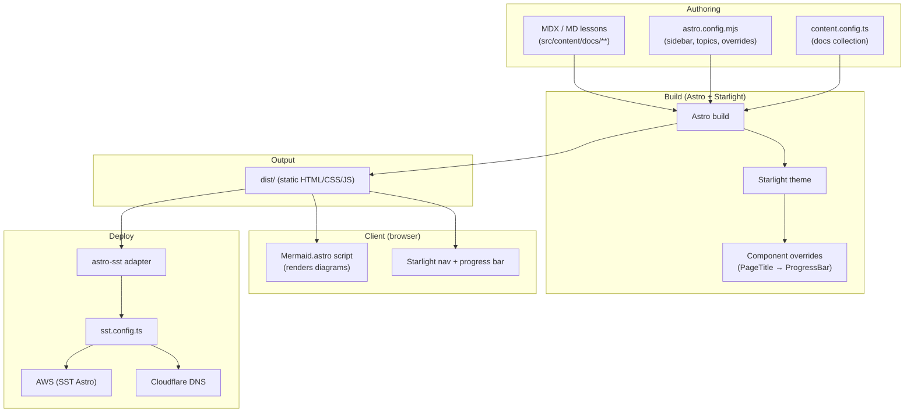
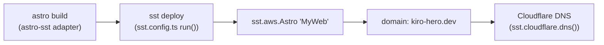

# Architecture

> System architecture and design patterns for the **kiro-hero** workshop site.

## Overview

kiro-hero is a **static, content-driven documentation site**. There is no runtime server or database in the application: Astro reads MDX content at build time and emits static HTML/CSS/JS into `dist/`. The only "dynamic" behavior is client-side JavaScript for diagram rendering and Starlight's built-in navigation.

## Architectural Layers

| Layer | Responsibility | Where |
| --- | --- | --- |
| Content | The actual workshop lessons and prose | `src/content/docs/**/*.mdx` |
| Configuration | Site identity, navigation structure, theme integration | `astro.config.mjs`, `src/content.config.ts` |
| Presentation / overrides | Custom UI grafted onto the Starlight theme | `src/components/*.astro`, `src/styles/custom.css` |
| Build | Transform content + config into static assets | Astro + Starlight (dependencies) |
| Infrastructure | Ship the built site to the internet | `sst.config.ts`, `astro-sst` adapter |

## Design Patterns & Principles

### Convention over configuration (file-based routing)
Folder structure under `src/content/docs/` *is* the URL structure. Adding a lesson is dropping a file in the right folder. Most sections use Starlight's `autogenerate`, so ordering is driven by frontmatter `sidebar.order` rather than a hand-maintained list.

### Sidebar as single source of truth
Lesson sequence, sectioning, and "next" links all derive from the Starlight sidebar at render time (see `ProgressBar.astro`). There is no separate lesson manifest to keep in sync — the navigation and the progress model cannot drift apart.

### Theme extension via component override
Rather than forking Starlight, the site overrides only the `PageTitle` component (declared in `astro.config.mjs`). The override composes the original (`@astrojs/starlight/components/PageTitle.astro`) and adds the progress bar. This keeps the project on the upstream upgrade path.

### Topic-per-workshop scaling model
`starlight-sidebar-topics` splits the site into independent topics, each with its own sidebar. The intended growth path (documented in `astro.config.mjs` comments) is: to add another workshop, create `workshops/<name>/` and add a sibling topic object. The progress bar scopes itself to the active topic automatically.

### Client-side, dependency-light diagrams
Mermaid diagrams render in the browser (`Mermaid.astro`), avoiding a build-time headless browser. The renderer is theme-aware and re-runs on Starlight client navigation (`astro:after-swap`) and on theme toggles (a `MutationObserver` on `data-theme`).

## Deployment Architecture

- `app()` sets the SST app name `kiro-hero`, `home: "aws"`, and a Cloudflare provider.
- Production stage uses `removal: "retain"` and `protect: true`; non-production stages use `removal: "remove"`.
- The README also documents an alternative fully-static deploy (Forgejo / GitHub Pages) using `site` + `base` for subpath hosting. The repo's primary config targets a root domain via SST/AWS.

## Cross-Cutting Concerns

| Concern | Approach |
| --- | --- |
| Theming / dark mode | Starlight provides light/dark; `Mermaid.astro` reads `document.documentElement.dataset.theme`; `custom.css` layers tweaks. |
| Typography | Self-hosted variable fonts loaded via `customCss` **before** the theme so `--sl-font` can use them. |
| Navigation continuity | Progress bar (global + section position + next link) on every multi-lesson page. |
| Upgrade safety | Minimal theme surface area (one component override) keeps Starlight upgradable. |
