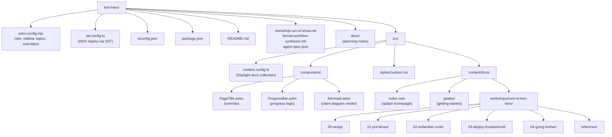

# Codebase Information

> Basic structural analysis of the **kiro-hero** repository.

## Identity

| Attribute | Value |
| --- | --- |
| Project name (package) | `zero-to-kiro` |
| Display title | Zero to Kiro Hero |
| Purpose | A hands-on workshop site for getting productive with the Kiro IDE/CLI |
| Type | Static documentation site (content-driven) |
| Production site | `https://kiro-hero.dev` |
| Status | Private, pre-1.0 (`version: 0.1.0`) |

## Technology Stack

| Layer | Technology |
| --- | --- |
| Site framework | [Astro](https://astro.build) v6 |
| Docs theme | [Starlight](https://starlight.astro.build) (`@astrojs/starlight`) |
| Sidebar plugin | `starlight-sidebar-topics` (topic switcher with per-topic sidebars) |
| Diagrams | `mermaid` (client-side rendering via a custom component) |
| Fonts | Self-hosted variable fonts: `@fontsource-variable/inter`, `@fontsource-variable/jetbrains-mono` |
| Language | TypeScript (extends `astro/tsconfigs/strict`) |
| Content format | Markdown / MDX |
| Deployment | [SST](https://sst.dev) v4 + `astro-sst` adapter → AWS; Cloudflare DNS |
| Package manager | npm (`package-lock.json` present) |

## Supported / Unsupported Languages for Analysis

| Language | Files | Analysis support |
| --- | --- | --- |
| TypeScript / JavaScript (`.ts`, `.mjs`) | Config + component frontmatter | Full |
| Astro components (`.astro`) | 3 components | Partial — frontmatter is TS; templates analyzed structurally |
| MDX / Markdown (`.mdx`, `.md`) | 23 lesson/content files + project docs | Content-level (not a programming language) |
| JSON (`.json`) | Config, schema, lockfile | Structural |

No backend application code, test suite, or server runtime exists in this repository — it is a static content site. This shapes the depth available for `data_models.md` and `interfaces.md` (see `review_notes.md`).

## Directory Structure

## Content Organization

All lesson content lives under `src/content/docs/`. Folder paths map directly to URL segments. The site is split into **topics** (via `starlight-sidebar-topics`):

| Topic | Entry point | Sidebar shape |
| --- | --- | --- |
| Guides | `/guides/getting-started/` | Single explicit page |
| Zero to Kiro Hero | `/workshops/zero-to-kiro-hero/00-setup/prerequisites/` | Sections (groups), mostly autogenerated |

Within the workshop topic, top-level sidebar groups are the "sections" the progress bar counts within:

| Section folder | Sidebar label | Population |
| --- | --- | --- |
| `00-setup/` | Setup | Explicit page list in `astro.config.mjs` |
| `01-primitives/` | Act 1 · The Primitives | `autogenerate` |
| `02-unfamiliar-code/` | Act 2 · Working in Unfamiliar Code | `autogenerate` |
| `03-deploy-troubleshoot/` | Act 3 · Deploy & Troubleshoot | `autogenerate` |
| `04-going-further/` | Going Further | `autogenerate` |
| `reference/` | Reference | `autogenerate`, collapsed, **excluded from progress** |

## Key Files at a Glance

| File | Role |
| --- | --- |
| `astro.config.mjs` | The control center — site URL, AWS adapter, Starlight options, font CSS, the `PageTitle` component override, and the entire sidebar/topic/section structure. |
| `sst.config.ts` | Infrastructure-as-code for deploying the static site to AWS with a custom domain and Cloudflare DNS. |
| `src/content.config.ts` | Declares the single `docs` content collection using Starlight's loader and schema. |
| `src/components/ProgressBar.astro` | Computes "you are here" progress by flattening the sidebar into a linear lesson sequence. |
| `src/components/PageTitle.astro` | Starlight override that renders the default title and appends the progress bar. |
| `src/components/Mermaid.astro` | Client-side Mermaid diagram renderer, theme-aware. |
| `src/styles/custom.css` | Theme tweaks layered over Starlight. |
| `agent-spec.json` | JSON Schema describing a Kiro agent configuration (reference material / content source). |

## Notable Conventions

- **No application backend** — everything is statically built by Astro into `dist/`.
- **Sidebar is the source of truth** for lesson ordering; the progress bar derives entirely from it rather than from a separate manifest.
- **Component override pattern** — Starlight components are customized by swapping them in `astro.config.mjs` (`components.PageTitle`), not by forking the theme.
- **Diagrams render in the browser** — no build-time headless browser dependency; `Mermaid.astro` runs `mermaid` client-side and reacts to theme changes.
- `sst.config.ts` is excluded from `tsconfig.json` and uses its own SST type reference.
