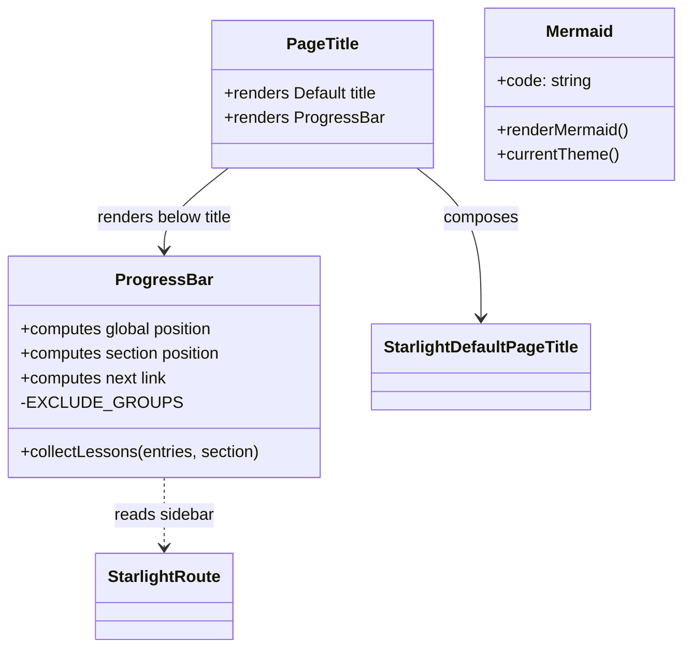

# Components

> Major components of the **kiro-hero** site and their responsibilities.

The application surface is intentionally small: three Astro components plus configuration. All custom UI behavior lives in `src/components/`.



## `PageTitle.astro`

**Role:** Starlight component override (registered in `astro.config.mjs` under `components.PageTitle`).

**Responsibility:** Render the stock Starlight page title, then render the workshop `ProgressBar` directly beneath it. It is a thin composition wrapper — it holds no logic of its own.

```astro
<Default />
<ProgressBar />
```

This is the single integration seam between the custom progress feature and the Starlight theme.

## `ProgressBar.astro`

**Role:** The "you are here" workshop progress indicator.

**Responsibility:** Turn the Starlight sidebar into a linear lesson sequence and report the learner's position.

Key behaviors:
- Reads the current route's sidebar from `Astro.locals.starlightRoute`.
- `collectLessons()` recursively flattens sidebar `group`/`link` entries into an ordered `Lesson[]`. Top-level groups define the `section`; nested groups inherit their parent's section.
- `EXCLUDE_GROUPS` (default: `{'Reference'}`) — top-level groups whose pages are left out of the count.
- Computes:
  - **Global position:** `Lesson N of total` + percentage fill.
  - **Section position:** `<Section> · N of M` (only shown when the section has more than one lesson).
  - **Next link:** the following lesson's label + href.
- **Self-hiding:** renders nothing unless the current page is found in the sequence *and* the topic has more than one lesson (`show = current !== -1 && total > 1`). This naturally hides it on the splash homepage and on single-page topics like Guides — no per-page opt-out needed.

**Data shape:**
```ts
type Lesson = { label: string; href: string; isCurrent: boolean; section: string };
```

## `Mermaid.astro`

**Role:** Client-side Mermaid diagram renderer for use inside MDX lessons.

**Responsibility:** Accept a diagram definition as a `code` prop and render it in the browser, matching the active theme.

Key behaviors:
- Props: `{ code: string }`. The definition is passed as a template-literal string so MDX does not try to parse arrows/brackets as JSX.
- Emits `<pre class="mermaid">` inside a `.not-content` figure (so Starlight's prose styles don't interfere).
- `currentTheme()` maps the document's `data-theme` (or the OS `prefers-color-scheme`) to Mermaid's `'dark'` / `'default'` themes.
- `renderMermaid()` caches each diagram's original source in `dataset.source` so it can be re-rendered after a theme change, then calls `mermaid.initialize({ startOnLoad: false, theme })` and `mermaid.run()`.
- Re-renders on Starlight client navigation (`astro:after-swap`) and on theme toggles (`MutationObserver` watching `data-theme`).

**Usage (from MDX):**
```mdx
import Mermaid from '../../../../components/Mermaid.astro';
<Mermaid code={`flowchart TD; A-->B;`} />
```

## Configuration "Components" (non-UI)

| File | Responsibility |
| --- | --- |
| `astro.config.mjs` | Declares the Starlight integration, font CSS, the `PageTitle` override, and the full topic/sidebar/section tree. The structural heart of the site. |
| `src/content.config.ts` | Defines the `docs` content collection with Starlight's `docsLoader()` and `docsSchema()`. Rarely edited. |
| `src/styles/custom.css` | Theme tweaks layered over Starlight defaults. |
| `sst.config.ts` | Infrastructure definition (AWS Astro deployment + Cloudflare DNS). |

## Content "Components"

Lesson content under `src/content/docs/` is not code, but each file is a self-contained unit with frontmatter (`title`, `description`, optional `sidebar.order`) and an MDX body that may import Starlight components (`Card`, `Steps`, `Aside`, `FileTree`, `CardGrid`) and the local `Mermaid` component. See `data_models.md` for the frontmatter schema.
