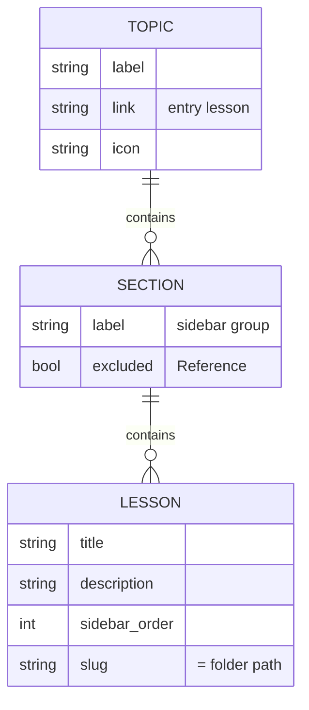

# Data Models

> Data structures and schemas in **kiro-hero**.

There is no database or persisted application state. The "data models" here are (1) the content collection schema, (2) the runtime types used by the progress bar, and (3) the agent JSON schema shipped as reference material.

## Content Collection

Defined in `src/content.config.ts`:

```ts
export const collections = {
  docs: defineCollection({ loader: docsLoader(), schema: docsSchema() }),
};
```

- **`docsLoader()`** — loads files from `src/content/docs/`.
- **`docsSchema()`** — Starlight's frontmatter schema (Astro generates types into `.astro/`).

### Lesson frontmatter (the practical schema)

Observed across lesson files and `README.md`:

```yaml
---
title: My Lesson           # required
description: One-line summary.   # used for meta + cards
sidebar:
  order: 2                 # controls autogenerate ordering (optional)
---
```

The splash homepage (`index.mdx`) uses Starlight's `splash` template with extra hero fields:

```yaml
---
title: Zero to Kiro Hero
description: ...
template: splash
hero:
  tagline: ...
  actions:
    - text: Start the workshop
      link: /workshops/zero-to-kiro-hero/00-setup/prerequisites/
      icon: right-arrow
      variant: primary
---
```



## Progress Bar Runtime Types

From `ProgressBar.astro`:

```ts
type Lesson = {
  label: string;
  href: string;
  isCurrent: boolean;
  section: string;   // top-level group label, '' if none
};
```

Derived values computed per render:

| Value | Meaning |
| --- | --- |
| `lessons: Lesson[]` | Flattened, ordered lesson sequence for the active topic |
| `current` | Index of the current lesson (`-1` if not found) |
| `total` | Total lessons in the topic |
| `percent` | `(current + 1) / total * 100`, rounded |
| `section` / `sectionLessons` / `sectionIndex` / `sectionTotal` | Section-scoped position |
| `show` | `current !== -1 && total > 1` — whether to render at all |

The sidebar entry shape consumed (implicit Starlight contract):
```ts
// link
{ type: 'link', label, href, isCurrent }
// group
{ type: 'group', label, entries: SidebarEntry[] }
```

## Agent Schema (reference content)

`agent-spec.json` is a JSON Schema (draft 2020-12) titled **"Agent"** describing a Kiro CLI agent configuration. It is reference material that informs the workshop's lesson content (notably `01-primitives/custom-agents.mdx`), not a runtime model of this site.

Selected top-level properties: `name`, `description`, `prompt`, plus (per the lessons and planning docs) `model`, `tools`, `allowedTools`, `toolsSettings`, `resources`, `mcpServers`, `hooks`, `welcomeMessage`, `keyboardShortcut`.

> ⚠️ See `docs/plan-custom-agents.md` for two known schema-vs-docs discrepancies (hook `timeout_ms` default; `includeMcpJson` vs `useLegacyMcpJson`). The lesson content treats the schema as authoritative for field names/shapes but defers exact values to current Kiro docs.

## Build Artifacts (generated, not source)

| Path | Content | Tracked? |
| --- | --- | --- |
| `.astro/` | Generated content types, data store, collection schemas | Ignored (`.gitignore`) |
| `dist/` | Static build output | Ignored |
