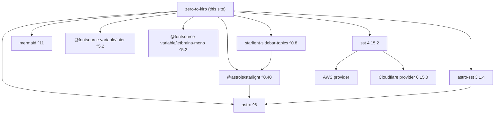

# Dependencies

> External dependencies and how **kiro-hero** uses them. Versions reflect `package.json` ranges (consult `package.json` / `package-lock.json` for exact resolved versions).

## Dependency Map

## Runtime / Build Dependencies

| Package | Range | Purpose | Used in |
| --- | --- | --- | --- |
| `astro` | `^6.4.7` | Core site framework, static build, routing, MDX | Everything; `astro.config.mjs` |
| `@astrojs/starlight` | `^0.40.0` | Documentation theme: layout, nav, search, components (`Card`, `Steps`, `Aside`, `FileTree`, `CardGrid`), `docsLoader`/`docsSchema` | `astro.config.mjs`, `content.config.ts`, lessons |
| `starlight-sidebar-topics` | `^0.8.0` | Splits site into topics with independent sidebars | `astro.config.mjs` |
| `mermaid` | `^11.15.0` | Client-side diagram rendering | `src/components/Mermaid.astro` |
| `@fontsource-variable/inter` | `^5.2.8` | Self-hosted body font | `astro.config.mjs` `customCss` |
| `@fontsource-variable/jetbrains-mono` | `^5.2.8` | Self-hosted monospace font | `astro.config.mjs` `customCss` |
| `astro-sst` | `3.1.4` (pinned) | Astro adapter for SST/AWS deployment | `astro.config.mjs` `adapter: aws()` |
| `sst` | `4.15.2` (pinned) | Infrastructure-as-code deploy framework | `sst.config.ts` |

> The two deployment packages (`astro-sst`, `sst`) are pinned to exact versions; the rest use caret ranges.

## Infrastructure Providers (declared in `sst.config.ts`)

| Provider | Version | Role |
| --- | --- | --- |
| AWS (`home: "aws"`, `sst.aws.Astro`) | via SST | Hosts the built static site |
| Cloudflare (`providers.cloudflare`) | `6.15.0` | DNS for `kiro-hero.dev` via `sst.cloudflare.dns()` |

## Toolchain / Implicit

| Tool | Source | Purpose |
| --- | --- | --- |
| TypeScript | `astro/tsconfigs/strict` (extended by `tsconfig.json`) | Strict typing for config + component frontmatter |
| `astro check` | Astro CLI | Content/type validation (`npm run check`) |
| npm | `package-lock.json` | Dependency management |

## Notes & Observations

- **No test framework, linter, or formatter** is declared in `package.json`. `astro check` is the only validation gate. (See `review_notes.md`.)
- `sst.config.ts` is **excluded** from `tsconfig.json` and relies on SST's own generated types (`./.sst/platform/config.d.ts`).
- `mermaid` is the only dependency that ships meaningful client-side JS to the browser; everything else is build-time.
- Font packages are loaded via `customCss` ordering so they resolve before Starlight's `--sl-font` variable is applied.
