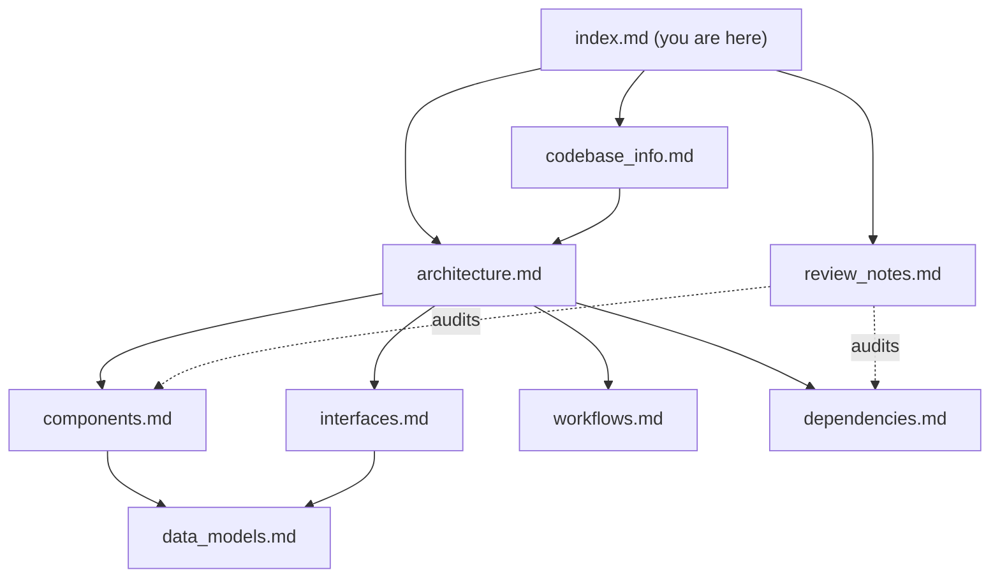

# Knowledge Base Index — kiro-hero

> **For AI assistants:** This file is the primary entry point for understanding the **kiro-hero** codebase. Read this first. It tells you what each document contains and which one to open for a given question, so you usually do not need to read every file. Each linked document contains deeper detail with Mermaid diagrams.

## What this project is

**Zero to Kiro Hero** (package name `zero-to-kiro`) is a **static documentation/workshop site** built with **Astro 6 + Starlight**, deployed to **AWS via SST** with Cloudflare DNS at `https://kiro-hero.dev`. Workshop lessons live as MDX under `src/content/docs/`. There is **no backend, database, or HTTP API** — it is content + a small amount of custom UI logic.

## How to use this knowledge base

1. Identify the question type using the routing table below.
2. Open the one or two documents that match.
3. Fall back to reading the actual source file named in that document for exact details.

## Document Routing Table

| If the question is about... | Read this document |
| --- | --- |
| Project identity, tech stack, file/directory layout, conventions | `codebase_info.md` |
| How the system fits together, design patterns, deployment topology | `architecture.md` |
| The custom components (`PageTitle`, `ProgressBar`, `Mermaid`) and their responsibilities | `components.md` |
| Contracts/seams: Starlight overrides, route locals, content collection, npm scripts, SST | `interfaces.md` |
| Frontmatter schema, progress-bar runtime types, agent JSON schema, content model | `data_models.md` |
| How to add a lesson/diagram/workshop, dev loop, deploy steps, progress render cycle | `workflows.md` |
| External packages, versions, infra providers, toolchain | `dependencies.md` |
| Known gaps, consistency findings, recommendations | `review_notes.md` |

## Document Summaries

### `codebase_info.md`
Identity, technology stack, supported/unsupported languages for analysis, the directory-structure Mermaid map, content organization (topics → sections → lessons), key files, and notable conventions. **Start here for orientation.**

### `architecture.md`
The static-site build pipeline (content + config → Astro/Starlight → `dist/` → SST/AWS), architectural layers, and core design patterns: file-based routing, sidebar-as-source-of-truth, theme extension via component override, topic-per-workshop scaling, and client-side diagrams. Includes deployment topology.

### `components.md`
Deep dive on the three Astro components. `PageTitle.astro` (override that composes the default + progress bar), `ProgressBar.astro` (flattens the sidebar into a linear lesson sequence; `EXCLUDE_GROUPS`; self-hiding logic), and `Mermaid.astro` (client-side, theme-aware diagram rendering). Plus the non-UI config "components."

### `interfaces.md`
The contracts between parts: Starlight component-override registration, the `Astro.locals.starlightRoute.sidebar` runtime contract, the content collection (`docsLoader`/`docsSchema`), sidebar/topic configuration (explicit vs `autogenerate`), the MDX→Mermaid prop contract, SST/AWS/Cloudflare deployment interfaces, and the npm script surface.

### `data_models.md`
Content collection definition, the practical lesson **frontmatter schema** (`title`, `description`, `sidebar.order`; splash `hero`), the `ProgressBar` runtime `Lesson` type and derived values, the sidebar entry shape, and the `agent-spec.json` reference schema (with discrepancy warnings).

### `workflows.md`
Step-by-step processes with diagrams: add a lesson, add a diagram, add a workshop/topic, local dev loop, progress-bar render cycle, SST/AWS deploy (with stage policies), and the alternative static Pages deploy.

### `dependencies.md`
Dependency map and per-package purpose/usage (Astro, Starlight, `starlight-sidebar-topics`, Mermaid, Fontsource fonts, `astro-sst`, `sst`), infra providers (AWS, Cloudflare 6.15.0), and toolchain notes (no test/lint/format configured).

### `review_notes.md`
Consistency verification across docs, completeness gaps (notably: no test/lint/format tooling; progress-bar logic untested; agent-spec discrepancies), and prioritized recommendations.

## Document Relationship Map

## Example Queries → Where to Look

| Example question | Primary doc(s) |
| --- | --- |
| "How do I add a new lesson and have it appear in the sidebar?" | `workflows.md` → also `codebase_info.md` (content org) |
| "Why doesn't the progress bar show on the homepage?" | `components.md` (`ProgressBar` self-hiding) |
| "Where is the site deployed and how?" | `architecture.md`, `workflows.md`, `interfaces.md` |
| "How do I embed a Mermaid diagram in a lesson?" | `workflows.md`, `components.md` |
| "What frontmatter does a lesson need?" | `data_models.md` |
| "How is the sidebar structured into sections?" | `codebase_info.md`, `interfaces.md` |
| "What would break if I upgrade Starlight?" | `review_notes.md`, `interfaces.md` (route-locals contract) |
| "What does `agent-spec.json` describe?" | `data_models.md` |

## Source-of-Truth Files (read these for exact detail)

- `astro.config.mjs` — sidebar/topics/sections, component override, fonts, site URL.
- `src/components/ProgressBar.astro` — progress logic.
- `src/components/Mermaid.astro` — diagram rendering.
- `src/content.config.ts` — content collection.
- `sst.config.ts` — deployment.
- `README.md` — human-facing quick start and the Pages deploy alternative.
