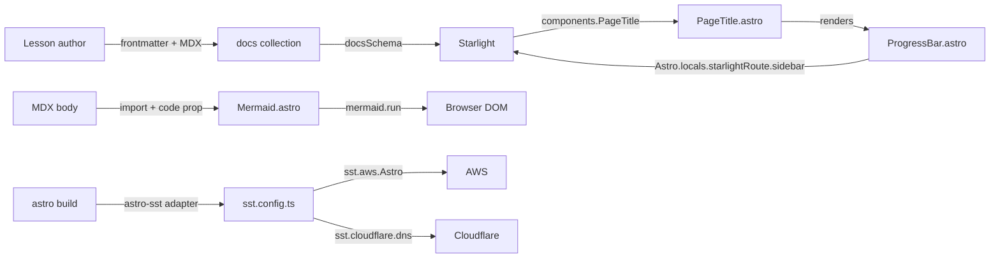

# Interfaces & Integration Points

> APIs, contracts, and integration seams in **kiro-hero**.

This is a static site, so there are **no HTTP APIs or RPC endpoints** in the application. The relevant "interfaces" are the contracts between content, the framework, custom components, and the deployment toolchain.

## Integration Map



## Component Interfaces (props)

| Component | Input contract | Output |
| --- | --- | --- |
| `PageTitle.astro` | none (Starlight override slot) | Default title + `<ProgressBar />` |
| `ProgressBar.astro` | `Astro.locals.starlightRoute.sidebar` (provided by Starlight) | `<nav class="ws-progress">` or nothing |
| `Mermaid.astro` | `Props { code: string }` | `<figure>` with client-rendered SVG |

## Framework Integration Points

### Starlight component override
Registered in `astro.config.mjs`:
```js
components: {
  PageTitle: './src/components/PageTitle.astro',
}
```
This is the contract by which Starlight allows the site to replace a named slot. The override is expected to render sensible content for the title region; here it composes the default and appends the progress bar.

### Starlight route locals
`ProgressBar.astro` consumes `Astro.locals.starlightRoute.sidebar`, a runtime-provided structure of sidebar entries. The component depends on the entry shape:
- `entry.type === 'link'` → `{ label, href, isCurrent }`
- `entry.type === 'group'` → `{ label, entries }`

This is an implicit contract with Starlight's internals; a Starlight major upgrade could change it (flagged in `review_notes.md`).

### Content collection contract
`src/content.config.ts` binds the `docs` collection to Starlight's loader + schema:
```ts
docs: defineCollection({ loader: docsLoader(), schema: docsSchema() })
```
Every file under `src/content/docs/` must satisfy `docsSchema()` frontmatter (see `data_models.md`).

### Sidebar / topic configuration
`starlight-sidebar-topics(...)` in `astro.config.mjs` defines topics and their sidebars. Two population mechanisms:
- **Explicit:** `{ label, slug }` items (used by the `Setup` group).
- **Autogenerate:** `{ autogenerate: { directory } }` (used by Acts 1–4 and Reference), ordered by each page's `sidebar.order`.

### MDX → Mermaid component
Lessons integrate diagrams by importing `Mermaid.astro` and passing a template-literal `code` prop. The template literal is required to prevent MDX/JSX from parsing diagram syntax.

## Deployment / Infrastructure Interfaces

| Interface | Defined in | Contract |
| --- | --- | --- |
| Astro adapter | `astro.config.mjs` → `adapter: aws()` (from `astro-sst`) | Tells Astro to build output compatible with SST's AWS Astro construct. |
| SST app config | `sst.config.ts` → `app(input)` | Returns app name, removal/protect policy by stage, `home: "aws"`, Cloudflare provider. |
| SST resource | `sst.config.ts` → `run()` → `new sst.aws.Astro("MyWeb", { domain })` | Provisions the hosted site with domain `kiro-hero.dev`. |
| DNS | `sst.cloudflare.dns()` | Delegates DNS for the custom domain to Cloudflare. |

## NPM Script Interface

Commands exposed via `package.json` (the developer-facing CLI surface):

| Script | Action |
| --- | --- |
| `npm run dev` / `npm start` | Astro dev server (default `http://localhost:4321`) |
| `npm run build` | Static build → `dist/` |
| `npm run preview` | Serve the built site |
| `npm run check` | `astro check` (type/content validation) |
| `npm run astro` | Pass-through to the Astro CLI |
