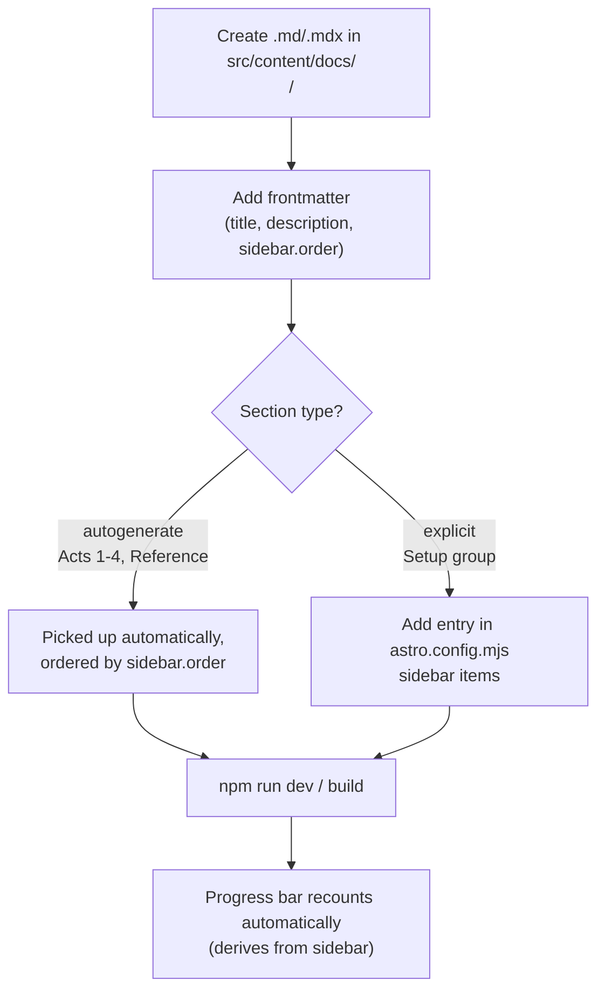
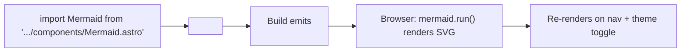
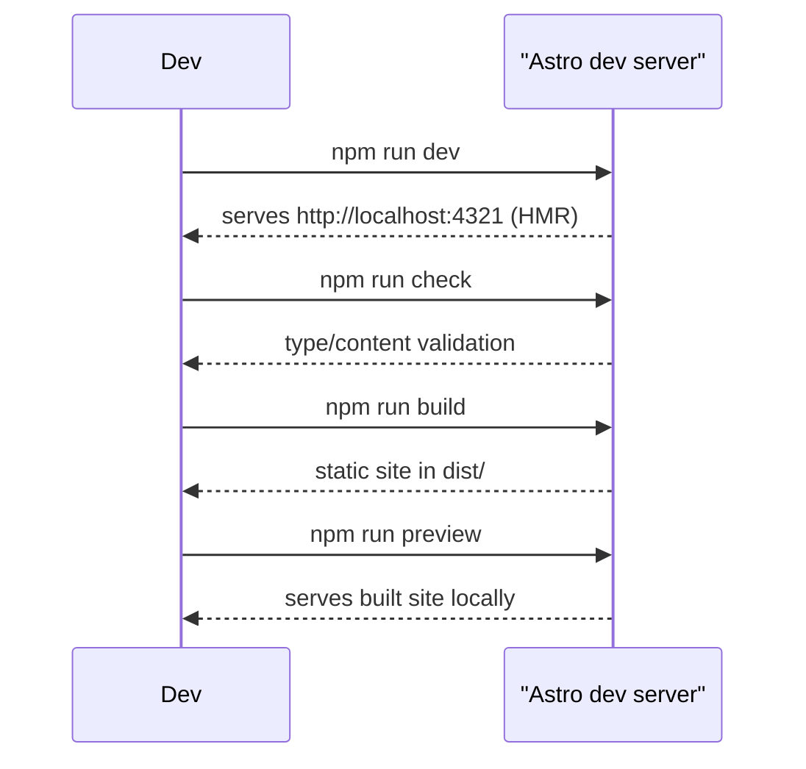
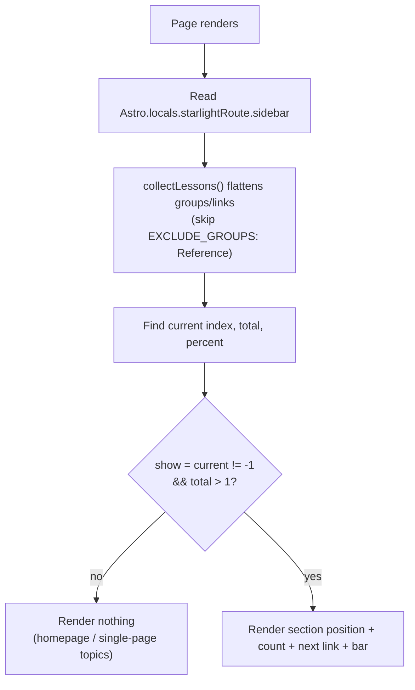
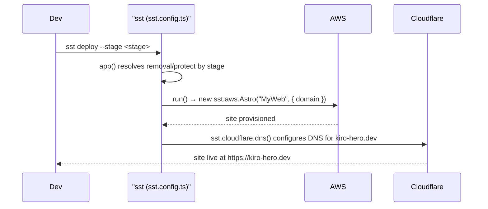

# Workflows

> Key processes and workflows in **kiro-hero**.

## 1. Add a Lesson

- Folder path = URL path.
- For `autogenerate` sections, no config edit is needed — only `sidebar.order` matters for position.
- The `Setup` group is the exception: its pages are listed explicitly in `astro.config.mjs`.

## 2. Add a Diagram to a Lesson

Use a template-literal `code` prop so MDX does not parse diagram syntax as JSX.

## 3. Add Another Workshop (topic)

Documented in `astro.config.mjs` comments:
1. Create `src/content/docs/workshops/<name>/`.
2. Add a sibling topic object inside `starlightSidebarTopics([...])` — `label` = workshop name, `link` = first lesson.
3. Define its sections as top-level groups (these become the progress bar's sections).
4. The progress bar scopes itself to whichever topic is active — no extra wiring.

## 4. Local Development

## 5. Progress Bar Render Cycle

## 6. Deploy to AWS (SST)

- **Production stage:** `removal: "retain"`, `protect: true` (guards against accidental teardown).
- **Other stages:** `removal: "remove"`.

## 7. Alternative Deploy: Static Pages (Forgejo / GitHub Pages)

Per `README.md`, the build is fully static and can be published without SST:
1. For a subpath project site, set `site` and `base` in `astro.config.mjs`.
2. `npm run build`.
3. Publish the contents of `dist/` via the Pages mechanism.

> Note: the committed `astro.config.mjs` targets a root domain (`site: "https://kiro-hero.dev"`, no `base`) and uses the SST/AWS adapter. The Pages path is an alternative documented in the README.
