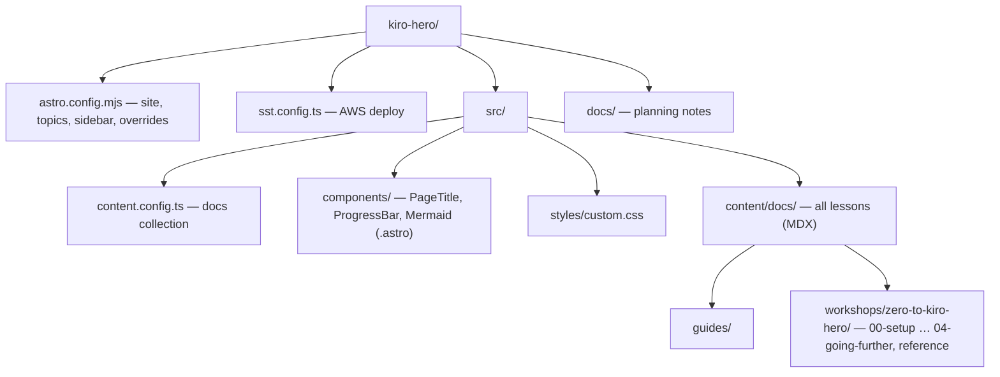

# AGENTS.md — kiro-hero

A starting point for AI agents working in this repository. **Zero to Kiro Hero** (npm package `zero-to-kiro`) is a static **Astro 6 + Starlight** workshop site, deployed to **AWS via SST** (Cloudflare DNS) at `https://kiro-hero.dev`. Lessons are MDX content; there is **no backend, database, or HTTP API**.

> Detailed docs live in `.agents/summary/`. Start with `.agents/summary/index.md` for routing to architecture, components, interfaces, data models, workflows, dependencies, and review notes.

## Table of Contents

- [Orientation](#orientation) — what to read first
- [Directory Map](#directory-map) — where things live
- [Key Entry Points](#key-entry-points) — files that control behavior
- [Repo-Specific Patterns](#repo-specific-patterns) — non-obvious conventions
- [Commands](#commands) — dev/build/deploy
- [Gotchas](#gotchas) — things that will surprise you
- [Custom Instructions](#custom-instructions) — human/agent-maintained

## Orientation

<!-- meta: navigation, first-read -->
This is a content-driven site. Most "features" are lessons under `src/content/docs/`. The only real application logic is three Astro components in `src/components/`. The site's structure (topics, sections, lesson order) is configured in `astro.config.mjs`, which is the single most important file.

## Directory Map

<!-- meta: navigation, structure -->

- **Folder path = URL path.** Lessons map to URL segments by their location under `src/content/docs/`.
- Sections are top-level sidebar groups: `00-setup` (Setup), `01-primitives` (Act 1), `02-unfamiliar-code` (Act 2), `03-deploy-troubleshoot` (Act 3), `04-going-further`, and `reference` (excluded from progress).

## Key Entry Points

<!-- meta: navigation, entry-points -->

| File | Why it matters |
| --- | --- |
| `astro.config.mjs` | Defines topics, sidebar/section tree, the `PageTitle` component override, fonts, and the `site` URL + AWS adapter. Edit here to restructure navigation. |
| `src/components/ProgressBar.astro` | The "you are here" logic — flattens the sidebar into a linear lesson sequence. The only non-trivial algorithm in the repo. |
| `src/components/Mermaid.astro` | Client-side, theme-aware diagram renderer used inside lessons. |
| `src/content.config.ts` | Declares the `docs` content collection (Starlight loader + schema). Rarely edited. |
| `sst.config.ts` | AWS deployment (custom domain + Cloudflare DNS). |

## Repo-Specific Patterns

<!-- meta: conventions, deviations -->

- **Sidebar is the single source of truth for lesson order.** The progress bar derives entirely from the Starlight sidebar (`Astro.locals.starlightRoute.sidebar`) — there is no separate lesson manifest. Navigation and progress cannot drift apart. See `.agents/summary/components.md`.
- **Most sections auto-populate.** Acts 1–4 and Reference use Starlight `autogenerate`, ordered by each lesson's `sidebar.order` frontmatter. The **`Setup` group is the exception** — its pages are listed explicitly in `astro.config.mjs`.
- **Theme is extended by overriding one component**, not by forking. `components.PageTitle` in `astro.config.mjs` points at `src/components/PageTitle.astro`, which composes Starlight's default title and appends `ProgressBar`. Keep the override surface minimal to stay upgradable.
- **`EXCLUDE_GROUPS` in `ProgressBar.astro`** (default `{'Reference'}`) lists sidebar groups left out of the progress count.
- **The progress bar self-hides** on the splash homepage and on single-page topics (`show = current !== -1 && total > 1`). No per-page opt-out needed.
- **Mermaid diagrams must use a template-literal `code` prop** (`<Mermaid code={`...`} />`) so MDX doesn't parse diagram syntax as JSX. Rendering happens in the browser and re-runs on navigation (`astro:after-swap`) and theme toggle.
- **Fonts are loaded via `customCss` ordering** before the theme, so `--sl-font` can pick up the self-hosted variable fonts.
- **Adding a workshop = adding a topic.** Create `workshops/<name>/` and add a sibling topic object in `starlightSidebarTopics([...])`. The progress bar scopes itself to the active topic.

## Commands

<!-- meta: workflow -->
Standard Astro scripts (`package.json`): `npm run dev` (localhost:4321), `npm run build` (→ `dist/`), `npm run preview`. Repo-specific/non-obvious:

- `npm run check` — runs `astro check` (the **only** automated validation gate; there is no test/lint/format tooling).
- Deploy is via **SST** (`sst.config.ts`), not a generic static host. Production stage is protected (`removal: "retain"`, `protect: true`). A static Forgejo/GitHub Pages path is documented in `README.md` and requires setting `site`+`base` for subpath hosting.

## Gotchas

<!-- meta: pitfalls -->
- **Three names for one thing:** package `zero-to-kiro`, title "Zero to Kiro Hero", directory `kiro-hero`. Search accordingly.
- **No test suite.** `ProgressBar.astro`'s sidebar-flattening logic is untested and depends on Starlight's internal `starlightRoute.sidebar` shape — re-verify after a Starlight major upgrade. See `.agents/summary/review_notes.md`.
- **`sst.config.ts` is excluded from `tsconfig.json`** and uses SST's own generated types.
- **`agent-spec.json`** is reference content for the lessons (a Kiro agent JSON Schema), not a runtime model of this site. `docs/plan-custom-agents.md` records two known schema-vs-docs discrepancies to resolve before publishing related lessons.
- **Two deploy stories coexist** (SST root-domain vs Pages `base`); don't mix their config.

## Custom Instructions
<!-- This section is for human and agent-maintained operational knowledge.
     Add repo-specific conventions, gotchas, and workflow rules here.
     This section is preserved exactly as-is when re-running codebase-summary. -->
